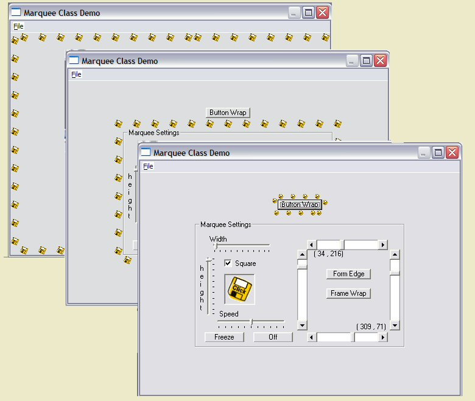



## Cls\_FormMarquee

### Description

Inspired by 'An old-fashioned Billboard Marquee' txtCodeId=51571 which is good looking but not very portable I built this class. I have always felt that if you need a large number of controls you should use the 'Load' command not painstakingly apply over a hundred controls. If you change resolution this can be very painful to upgrade. This class simple creates (and deletes) controls on the fly using just one indexed Image control as a seed. If you make a large change in the size of the marquee there is a slight delay. The screenshot doesn't really tell you much (no movement) just imagine all the little disks (yellow dots) moving
 
### More Info
 

             |
---                |---
**Submitted On**   |2004-02-10 22:31:04
**By**             |[Roger Gilchrist](https://github.com/Planet-Source-Code/PSCIndex/blob/master/ByAuthor/roger-gilchrist.md)
**Level**          |Intermediate
**User Rating**    |5.0 (10 globes from 2 users)
**Compatibility**  |VB 6\.0
**Category**       |[Graphics](https://github.com/Planet-Source-Code/PSCIndex/blob/master/ByCategory/graphics__1-46.md)
**World**          |[Visual Basic](https://github.com/Planet-Source-Code/PSCIndex/blob/master/ByWorld/visual-basic.md)
**Archive File**   |[Cls\_FormMa1707032102004\.zip](https://github.com/Planet-Source-Code/roger-gilchrist-cls-formmarquee__1-51657/archive/master.zip)

